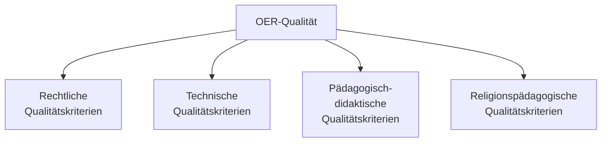
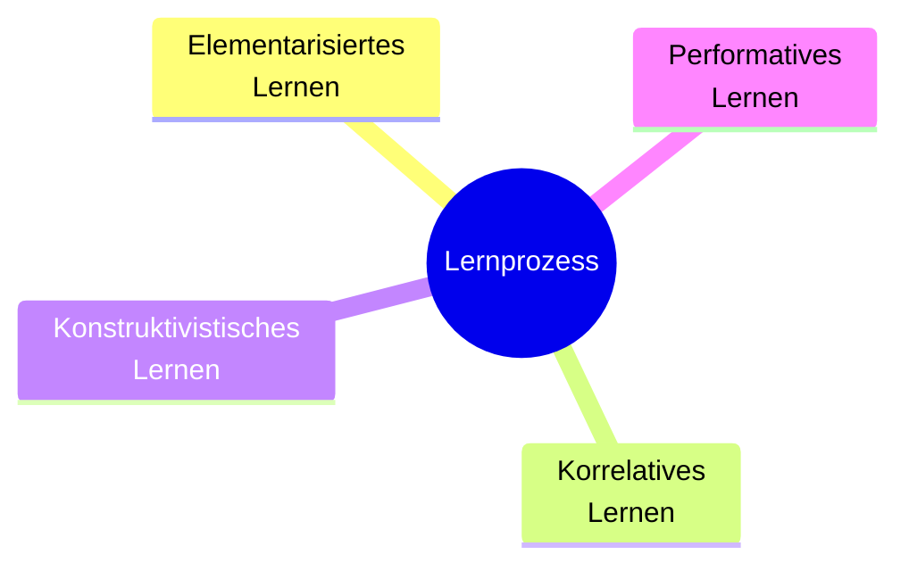
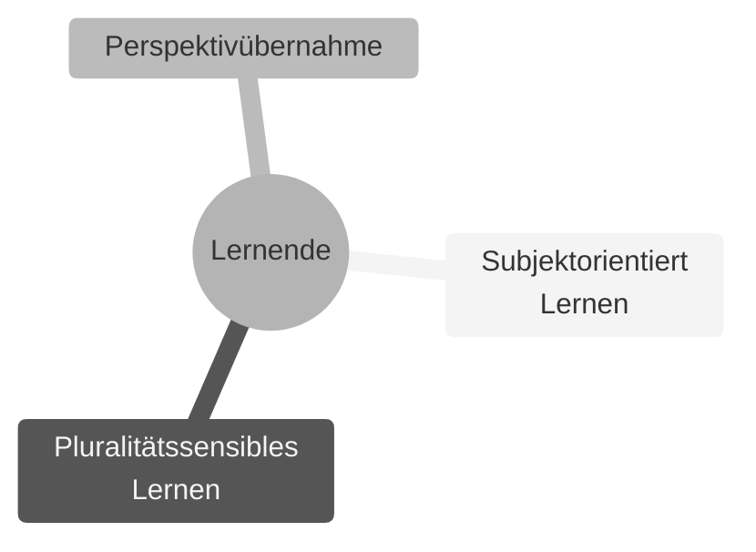
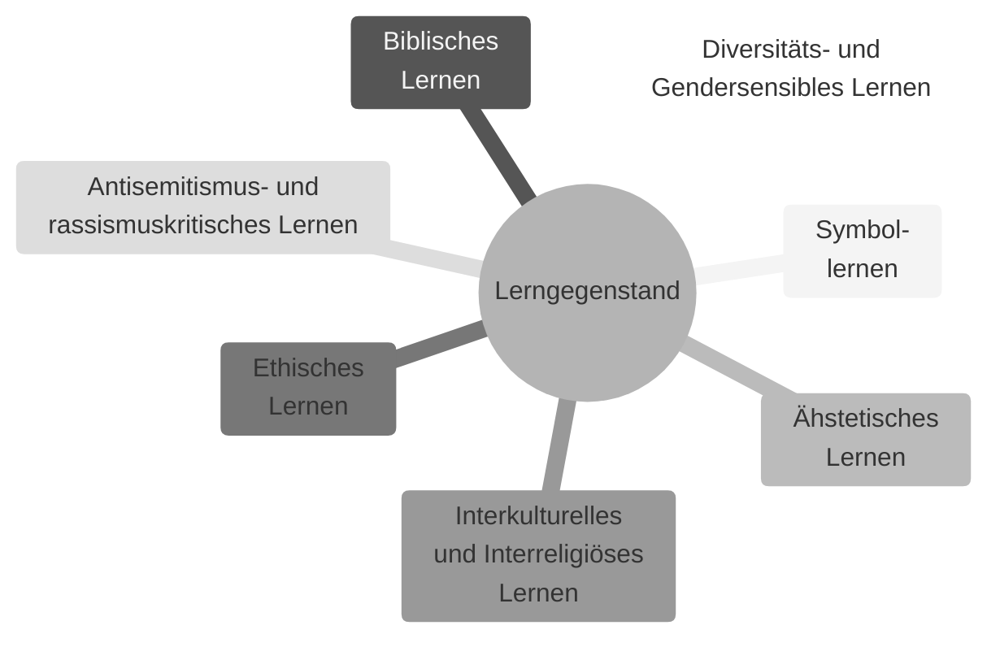

# Open Educational Resources in der Religionspädagogik erstellen und bewerten
## Rechtliche, technische, pädagogisch-didaktische und religionspädagogische Qualitätskriterien 

Eine Handreichung im Rahmen des Projekts FOERBICO –
Förderung offener Bildungspraktiken in religionsbezogenen Communities durch die Entwicklung eines koordinierten OER-Ökosystems. 

Angelina, Phillip / Buchwald-Chassée, Gina / Gregorio Rodrigo, Paula / Mößle, Laura / Ullmann, Corinna  
Frankfurt, Erlangen-Nürnberg, Münster 2025.  

*Open Educational Resources in der Religionspädagogik erstellen und bewerten*, 2025  
von Angelina, Phillip / Buchwald-Chassée, Gina / Gregorio Rodrigo, Paula / Mößle, Laura / Ullmann, Corinna  
 [CC BY 4.0](https://creativecommons.org/licenses/by/4.0/).

gefördert vom BMBFSFJ unter den Förderkennzeichen: 01PO23012A, 01PO23012B und 01PO23012C 

# Vorwort

## Ziel der Handreichung

Offene Bildungsressourcen, im Englischen als *Open Educational Resources (OER)* bezeichnet, ermöglichen es Lehrenden, Materialien rechtssicher zu teilen, weiterzuentwickeln und für unterschiedliche Lehr- und Lernszenarien nutzbar zu machen. Sie sind frei zugänglich und lassen sich flexibel an verschiedene didaktische Kontexte anpassen. Die Offenheit dieser Materialien verweist zugleich auf eine Haltung, die eine Bildungskultur beschreibt, in der Teilhabe nicht nur ermöglicht, sondern als grundlegendes Prinzip pädagogischen Handelns verstanden wird.

Besonders im Kontext der Lehrer:innenbildung spielen OER eine doppelte Rolle: Einerseits werden sie in der Hochschullehre selbst genutzt, um Lernprozesse zu unterstützen. Andererseits entstehen an Hochschulen zunehmend Materialien, die gezielt für den schulischen Einsatz konzipiert werden, etwa im Rahmen von Seminaren, Forschungsprojekten oder Praxisphasen. Diese Schnittstelle zwischen Hochschule und Schule erfordert klare Qualitätsskriterien, die beiden Bereichen gerecht werden.

Qualität bedeutet mehr als inhaltliche Richtigkeit. Sie umfasst rechtliche Klarheit, technische Standards, didaktische Passung sowie die Anschlussfähigkeit an unterschiedliche Lehr-Lern-Kontexte (vgl. Zawacki-Richter/Mayrberger 2017, S. 6f).
Qualitativ hochwertige OER setzen eine eigenständige Planung sowie den gezielten Einsatz von Ressourcen und Zeit voraus. Ihre Erstellung ist nicht als Nebenprodukt zu verstehen, sondern als eigenständige Aufgabe. Da die nachträgliche Umwandlung bestehender Materialien in OER häufig aufwendig ist, empfiehlt es sich, Lehr- und Lernmaterialien von Beginn an als OER zu konzipieren und dafür die notwendigen Ressourcen einzuplanen

Diese Handreichung richtet sich an Lehrende, die im Bereich der Religionspädagogik OER erstellen oder ihre Qualität in schulischen, hochschulischen oder außerschulischen Bildungssettings bewerten möchten.  
OER werden in der Handreichung als Ausdruck einer Bildungskultur verstanden, die von Offenheit, Teilhabe und dialogischer Auseinandersetzung geprägt ist. Entsprechend wird an zentrale, subjektorientierte Prinzipien religiöser Bildung angeknüpft. 

## OER-Qualität im diskursiven Horizont

Die freie Nutzbarkeit und Weiterverbreitung von OER stellt die Frage der Qualität vor gewisse Herausforderungen. Neben der Unsicherheit zu urheberrechtlichen Fragen stellt die die Qualität von OER eine der am breitesten diskutiertesten Themen im Umfeld von OER dar [(vgl. Ehlers 2015)](https://www.researchgate.net/publication/327393832_Qualitatsentwicklung_fur_OER_-_viel_besprochen_wenig_realisiert). 
Die Qualität von OER wird als wesentlicher Faktor für den Erfolg und die Akzeptanz von OER im breiten Feld angeführt [(vgl. Pirker & Pirner 2025)](https://doi.org/10.58069/theow.2025.1.51). 
Angebtrieben durch die Entwicklungen mit KI steigt die Anzahl frei verfügubarer Bildungsmaterialien im Internet rasant an. Aus diesem Grund stellt die die Identifikation von qualitativ hochwertigen OER eine immer größere Herausforderung dar. 

Nutzende bewerten die Qualität von OER oftmals auf Basis ihrer individuellen Anforderungen und Bedarfe. Dies führt dazu, dass Qualitätsvorstellungen im Diskurs stark auseinandergehen. Die prozesshafte Natur der Materialien, d.h. dass sie verändert und adaptiert werden, stellt eine besondere Herausforderungen der Qualitätssicherung dar [(vgl. Ehlers 2015)](https://www.researchgate.net/publication/327393832_Qualitatsentwicklung_fur_OER_-_viel_besprochen_wenig_realisiert). Statische Qualitätssicherungsprozesse, die Kriterien festlegen und überprüfen sind bei OER nur bedingt sinnvoll. Da sie eine hohe Offenheit und Anpassbarkeit an individuelle Kontexte, Bedrüfnisse und Anforderungen der Zielgruppe ermöglichen braucht es für die Qualitätssicherung eine besondere Aufmerksamkeit. 

Dennoch ist ein Orientierungslinie bedeutsam, um eine grundlegende Struktur für die Qualität von OER zu schaffen, schließlich auch um das Vertrauen in offene Bildungsressourcen zu stärken [(vgl. Lübben/ Müskens/ Zawacki-Richter 2023)]

[Baas et al. (2022)](https://oda.oslomet.no/oda-xmlui/bitstream/handle/11250/3063763/Baas%2bet%2bal.%2b%25282022%2529.pdf?sequence=1&isAllowed=y) zeigen mit ihrer Studie eindrücklich, dass die Qualität von OER kein feststehendes Attribut ist, sondern das Ergebnis eines dialogischen Aushandlungsprozesses. Lehrende bewerten Materialien demnach nicht isoliert, sondern entwickeln ihre Qualitätswahrnehmung im Austausch mit Kolleg:innen und im Kontext institutioneller Rahmenbedingungen. 

Die Handreichung versteht die Qualitätkriterien nicht als Garantie *guter OER* und damit *guter religiöser Bildungsprozesse*. Sie ist vielmehr als reflexives Instrument konzipiert, das die Vielschichtigkeit religionspädagogischer Qualitätsdebatten aufgreift und Lehrenden und Materialerstellenden eine Orientierung bietet, ohne in reduktionistische 'Abhak-Logik' zu verfallen. 
Qualität wird  als Ergebnis eines fortlaufenden Aushandlungsprozesses verstanden, der sich sowohl in der Erstellung als auch in der Nutzung und Weiterentwicklung von OER vollzieht.

## Qualitätsdimensionen

Die in dieser Handreichung formulierten Kriterien bieten eine praxisnahe Orientierung für die Erstellung und Bereitstellung von OER aus religionspädagogischer Perspektive. Sie verdeutlichen, welche rechtlichen, technischen, pädagogisch-didaktischen und fachspezifisch religionspädagogischen Anforderungen zu berücksichtigen sind und nach welchen Merkmalen OER entwickelt und bewertet werden können.

Die Handreichung gliedert sich in *vier zentrale Qualitätsdimensionen*:
1.	Rechtliche Qualität: Hier werden die grundlegenden rechtlichen Voraussetzungen für OER, insbesondere im Hinblick auf Lizenzen und Urheberrecht benannt.
2.	Technische Qualität: Hier werden Merkmale aufgeführt, die eine langfristige und barrierefreie Bereitstellung der Materialien sicherstellen.
3.	Pädagogisch-didaktische Qualität: Hier werden zentrale Lehr-Lern-Prinzipien, darunter Lernaktivitäten, Transfermöglichkeiten und Formen der Lernerfolgskontrolle der OER dargestellt.
4.	Religionspädagogische Qualität: Hier werden Merkmale religionsdidaktischer Prinzipien und Lernwege dargestellt, die für die Gestaltung und Bewertung von offenen Bildungsmaterialien im Fach Religion bedeutsam sind.
 

 
*Abbildung 1: Vier Dimensionen der OER-Qualität*

## Entstehungshintergrund

Die Handreichung wurde im Rahmen des Projekts FOERBICO erstellt, einem vom BMBFSFJ geförderten Verbundprojekt der Goethe-Universität Frankfurt, der Friedrich-Alexander-Universität Erlangen-Nürnberg und des Comenius-Instituts Münster. Als Teil des Programms „Communities“ innerhalb der OER-Strategie verfolgt FOERBICO das Ziel, ein nachhaltiges Ökosystem zur Förderung offener Bildungspraktiken in religionsbezogenen Communities zu etablieren.
Die Handreichung wurde als Checkliste aufgebaut und basiert in Teilen auf den Qualitätsmerkmalen von Mayberger/ Zawacki-Richter/ Müskens (2018) und Kobusch/ Halm (2022). Die Handreichung erweitert bestehende Qualitätsmodelle um eine spezifisch religionspädagogische Perspektive. Sie formuliert sowohl fachwissenschaftliche als auch fachdidaktische Anforderungen an religionspädagogische OER und versteht offene Bildungsmaterialien als Inspirationsquelle sowie als Grundlage für kreative pädagogische Weiterarbeit.
Die Qualitätskriterien sind im Rahmen eines iterativen Prozesses entstanden, in dem theoretische Auseinandersetzung und empirische Reflexion miteinander verbunden wurden. Die Handreichung ist als offenes, fortschreibbares Dokument angelegt, das weiterhin elaboriert und ergänzt werden soll.

Die Handreichung soll Lehrende bei der reflexiven Auseinandersetzung mit Qualität begleiten. Sie bietet jedoch keine rechtsverbindliche Auskunft und ersetzt nicht die eigenverantwortliche Prüfung der Materialien.

 
# 1.	Rechtliche Qualitätsmerkmale

Für die rechtssichere Veröffentlichung offener Bildungsmaterialien ist die Beachtung zentraler urheberrechtlicher Vorgaben unerlässlich, insbesondere beim Einsatz von Inhalten Dritter, wie bspw. Grafiken, Bildern oder Textauszügen. Bei externen Materialien ist stets davon auszugehen, dass sie urheberrechtlich geschützt sind, unabhängig davon, ob ein entsprechender Hinweis vorliegt, da dieser Schutz automatisch gilt. 
Im schulischen und hochschulischen Unterrichts- und Lehrkontext greift die sog. Bildungs- und Wissenschaftsschranke (§ 60a UrhG). Sie erlaubt Lehrenden, urheberrechtlich geschützte Werke im Rahmen von Lehre und Unterricht in begrenztem Umfang – konkret bis zu 15 % eines Werkes – zu nutzen, sofern die Materialien nur einem klar abgegrenzten Teilnehmer:innenkreis zugänglich gemacht werden.
Für OER gilt diese Schranke jedoch nicht, da es sich bei offenen Bildungsmaterialien um dauerhaft öffentlich zugängliche Inhalte handelt. Eine Veröffentlichung als OER ist deshalb nur zulässig, wenn für das verwendete Fremdmaterial eine ausdrückliche Nutzungserlaubnis vorliegt, bspw. in Form einer offenen Lizenz wie Creative Commons.
Grundsätzlich sollten OER bevorzugt aus selbst erstellten Inhalten bestehen. 
Auch bei KI-generierten Inhalten (z. B. aus Tools wie DALL·E) ist Vorsicht geboten. Je nach Plattform gelten unterschiedliche Lizenz- und Nutzungsbedingungen, die vor einer Verwendung im OER-Kontext sorgfältig geprüft werden müssen.

## Verwendung geschützter Elemente
- [ ] Das Material ersetzt geschützte Elemente (Bilder, Grafiken, Videos, Karten, Audio, [Schrift](https://https://open-educational-resources.de/texte-und-schriftarten/) oder Logos), sofern möglich, durch offen lizenzierte Alternativen.
- [ ] Das Material enthält notwendige Quellenangaben korrekt und vollständig.
- [ ] Für die Nutzung urheberrechtlich geschützter Inhalte liegen die erforderlichen Nutzungsrechte vor.
- [ ] Externe Inhalte im Material, die unter einer CC-Lizenz stehen, sind korrekt, d.h. gemäß der sog. TULLU-Regel gekennzeichnet (siehe [TULLU-Regel](https://https://open-educational-resources.de/oer-tullu-regel/)).

> [!TIP]
> **Die TULLU-Regel für die korrekte Nutzung von CC-lizenzierten Inhalten**
> Wer OER erstellt und dabei Materialien nutzt, die unter einer **Creative-Commons-Lizenz** stehen, muss die Lizenzbedingungen korrekt kennzeichnen. Die **TULLU-Regel** bietet eine einfache Eselsbrücke, um keine Pflichtangabe zu vergessen:
> | Akronym| Bedeutung               | Erklärung                                                                                      |
> |-----------|-------------------------|-----------------------------------------------------------------------------------------------|
> | **T**     | **Titel**               | Genauen **Titel** des Werks angeben, sofern vorhanden                                    |
> | **U**     | **Urheber:in**          |  **Autor:in** des Materials, wie auf dem Material angegeben, korrekt aufführen, ggf. mit Link zur Website   |
> | **L**     | **Lizenzbezeichnung**   | **Lizenz** des Materials angeben, z. B. `CC BY 4.0`                                   |
> | **L**     | **Link zur Lizenz**     | Vollständige **Lizenzbeschreibung** verlinken, z. B. [CC BY 4.0 DE](https://creativecommons.org/licenses/by/4.0/deed.de) |
> | **U**     | **Ursprungsort/Quelle** | Verweis auf die **Ursprungsort** des Materials, z. B. Website, Repository oder Plattform   |
> Die TULLU-Regel sichert ab, dass die Bedingungen der CC-Lizenzen zuverlässig erfüllt werden.

    

## Lizenzauswahl und Veröffentlichung
- [ ] Das Material führt die Urheber:innen mit einer Kontaktmöglichkeit auf und berücksichtigt Miturheber:innen (z. B. Lehrende, Projektpartner:innen oder Studierende) mit deren Zustimmung zur Veröffentlichung.
- [ ] Vorgaben seitens der Hochschule, des Geldgebers oder der Projektpartner für die Veröffentlichung und Lizenzierung wurden beachtet.
- [ ] Das Material verwendet eine ausgewählte CC-Lizenz, die den Veröffentlichungswünschen entspricht (siehe [CC-Lizenzen](https://oer.community\oer-und-oep\handout-cc-lizenzen.pdf)).
- [ ] Das Material weist die Lizenzbedingungen sowie eventuelle Ausnahmen korrekt und transparent aus.

> [!TIP]
> >**Creative Commons-Lizenzen im Überblick**
>
> | Lizenz | Beschreibung |
> |--------|--------------|
> |  | **[CC BY](https://creativecommons.org/licenses/by/4.0/deed.de)** Erlaubt das Verbreiten, Remixen, Verbessern und Aufbauen, auch kommerziell, solange der Urheber des Originals genannt wird. |
> |  | **[CC BY SA](https://creativecommons.org/licenses/by-sa/4.0/deed.de)** Wie CC BY, jedoch müssen neue Werke unter denselben Bedingungen veröffentlicht werden. |
> |  | **[CC BY ND](https://creativecommons.org/licenses/by-nd/4.0/deed.de)** Erlaubt die Weiterverbreitung, auch kommerziell, jedoch ohne Veränderungen und mit Namensnennung. |
> |  | **[CC BY NC](https://creativecommons.org/licenses/by-nc/4.0/deed.de)** Wie CC BY, jedoch nur für nicht-kommerzielle Zwecke. |
> |  | **[CC BY NC SA](https://creativecommons.org/licenses/by-nc-sa/4.0/deed.de)** Wie CC BY SA, jedoch nur für nicht-kommerzielle Zwecke. |
> |  | **[CC BY NC ND](https://creativecommons.org/licenses/by-nc-nd/4.0/deed.de)** Wie CC BY ND, jedoch nur für nicht-kommerzielle Zwecke. |
> |  | **[CC0](https://creativecommons.org/publicdomain/zero/1.0/deed.de)** Verzicht auf alle urheberrechtlichen und verwandten Schutzrechte. |

## KI-generierte Materialien
- [ ] KI-generierte Inhalte sind im Material gekennzeichnet und das verwendete Tool ist angegeben
- [ ] Die Quellenangabe enthält Tool, Erstellungsdatum, ggf. Lizenzhinweis und Bearbeitername (z. B. „Bild generiert mit ChatGPT (OpenAI, 2025), bearbeitet durch …“. Weiterführende Informationen [hier](https://digitalzentrum-berlin.de/leitfaden-ki-generierte-inhalte-kennzeichnen)).  
- [ ] Rechtliche Fragen KI-genertierter Materialien mit Blick auf Urheberrecht, Lizenzierung und Einschränkungen der Plattform sind geprüft und im Material  gekennzeichnet.  
- [ ] KI-generiertes Bildmaterial ist sorgfältig ausgewählt, vermeidet Verzerrungen und Stereotype.  
- [ ] KI-generiertes Bildmaterial ist didaktisch sinnvoll eingebunden und fördert die kritische Bildkompetenz der Lernenden.  

 
> [!TIP]
> Für die Erstellung von offenen Bildungsmaterialien ist der rechtssichere und reflektierte Umgang mit Bildern (z.B. mit Blick auf theologische und kulturelle Darstellungen, Stereotype, Diversität) entscheidend.
> Folgende Bilddatenbanken enthalten OER-Lizenzen
> - Wikimedia Commons – https://commons.wikimedia.org  
>   Große Sammlung, meist CC-BY oder CC-BY-SA.  
> - Openverse – https://openverse.org  
>   Suchmaschine für freie Bilder, Audio und Videos.  
> - Bilderhamster – https://bilderhamster.de  
>   CC0-Fotos mit Stichwortsuche und Filtermöglichkeiten.  
> - Flickr – https://flickr.com  
>   Ermöglicht die Suche nach Creative-Commons-Bildern .  
> - Google Bildersuche – https://images.google.com  
>   Erweiterte Suche mit Filter „Nutzungsrechte“; Lizenzangaben stets auf der Ursprungsseite prüfen.  
>
>Freie Illustrationen und Vektoren  
> - Openclipart – https://openclipart.org  
>   CC0-Grafiken, downloadbar als SVG.  
> - OpenMoji – https://openmoji.org  
>   CC-BY-SA Emojis und Icons.  
> - Public Domain Vectors – https://publicdomainvectors.org  
>   Freie Vektorgrafiken (CC0), in Formaten wie .svg, .eps, .ai.  
> - Humaaans – https://www.humaaans.com  
>   Sammlung moderner Illustrationen von Menschen (CC0).  
> - Cocomaterial – https://cocomaterial.com  
>   Illustrationen unter CC0, frei anpassbar in Größe und Farbe, Download als PNG oder SVG.  
> 
> Kunstsammlungen (Public Domain)  
> - The Met Collection – https://www.metmuseum.org/art/collection  
>   Kunstwerke der Public Domain, veröffentlicht unter CC0.  
> - Rijksmuseum Amsterdam – https://www.rijksmuseum.nl/en/rijksstudio  
>   Bilder und Kunstwerke in der Public Domain, frei nutzbar (CC0).  
>
> Alternativen  
> - Eigene Fotos oder Zeichnungen  
> - Sketchnotes, Diagramme, Visualisierungen (z. B. mit Excalidraw oder GoodNotes)  

# 2.	Technische Qualitätsmerkmale
Die technische Qualität von OER ist entscheidend für ihre Nutzbarkeit und Weiterverwendbarkeit. Damit Materialien einfach zugänglich, auffindbar und bearbeitbar sind, sollten sie mit strukturierten Metadaten versehen und in offenen, verbreiteten Dateiformaten bereitgestellt werden. Dies kann unter Umständen bedeuten, Materialien in mehreren Formaten bereitzustellen, um ihre Wiederverwendung in unterschiedlichen Kontexten zu ermöglichen. Eine sorgfältige Metadatenpflege erleichtert nicht nur die Auffindbarkeit, sondern unterstützt Verbreitung in verschiedene Netzwerke und gewährleistet ihre langfristige Nutzbarkeit. Je nach Repositorium, in dem die Materialien veröffentlicht werden, können sich die Vorgaben für die Metadatenstandards unterscheiden. 
Bedeutsam ist auch die Barrierefreiheit für Menschen mit Beeinträchtigungen mitzudenken. Hierfür sind bspw. das Bereitstellen von Alternativtexten oder optimierte Farbauswahl zu berücksichtigen. 
Wenn Material in Kombination mit geschützten Texten, Bildern, Audios und Videos entsteht, ist darauf zu achten die verschiedenen Elemente entsprechend zu kennzeichnen und somit das Material zu modularisieren. Damit wird für jede Person ersichtlich, welche Teile des Materials unter offener Lizenz stehen und welche nicht. Zugleich wird das [Remixen](https://irights.info/wp-content/uploads/2018/10/JOINTLY-BROSCHUERE-OER-richtig-verwenden-Kombinieren-Bearbeiten-Remixen-Auflage-Okt2018.pdf) des Materials erleichtert.

## Zuverlässigkeit & Kompatibilität
- [ ] Das Material ist mit verschiedenen Geräten und Betriebssystemen kompatibel.
- [ ] Die verwendeten Tools sind langfristig nutzbar (z. B. Plattformen, Software oder Anwendungen, die für die Nutzung oder Bearbeitung des Materials erforderlich sind. Diese sollten möglichst offen, kostenfrei und dauerhaft erreichbar sein.)
- [ ] Das Datum der Materialerstellung ist aufgeführt. 

## Technische Wiederverwendbarkeit
- [ ] Das Material wird in offenen und verbreiteten Dateiformaten bereitgestellt.
- [ ] Es ist unabhängig von spezifischer Software oder Hardware nutzbar.
- [ ] Standardisierte Metadaten sind enthalten (Urheber, Titel, Lizenz, Format, Zielgruppe).
- [ ] Die Bereitstellung erfolgt über Plattformen oder Repositorien mit langfristiger Archivierung. 

> [!TIP]
**Vollständig offene Formate**  
> - **Text & Dokumente:** `.txt`, `.odt`, `.pdf`, `.md`, `.rtf`  
> - **Tabellen & Daten:** `.csv`, `.ods`, `.tsv`, `.json`, `.xml`  
> - **Bilder & Grafiken:** `.png`, `.jpg`, `.svg`, `.webp`, `.tiff`  
> - **Audio:** `.mp3`, `.ogg`, `.flac`, `.wav`  
> - **Video:** `.mp4`, `.webm`, `.ogv`  
> - **Präsentationen:** `.odp`  
>
> **Offen dokumentierte, aber proprietär geprägte Formate**  
> Gut für Kompatibilität mit verbreiteter Software, aber langfristig weniger nachhaltig als offene Formate:  
> - **Dokumente:** `.docx`  
> - **Tabellen:** `.xlsx`  
> - **Präsentationen:** `.pptx` 
>
> Es ist sinnvoll, Materialien in mindestens einem vollständig offenen Format bereitzustellen, um ihre Nutzbarkeit und Weiterbearbeitung sicherzustellen.

## Struktur, Navigation & Orientierung
- [ ] Die Inhalte im Material sind klar gegliedert (z. B. nach Kapiteln, Modulen oder Lerneinheiten).
- [ ] Jede Einheit enthält eine übersichtliche Struktur mit Überschriften, Absätzen und visuellen Elementen.
- [ ] Zu Beginn einer Lerneinheit gibt es eine kurze Beschreibung des Inhalts, der Lernmethode, der Lernziele und benötigten Materialien.
- [ ] Das Material ist modular aufgebaut und kann auch in Teilen verwendet werden.
- [ ] Visuelle Elemente (Diagramme, Bilder, Karten oder Videos) sind verständlich eingebettet und beschriftet.
- [ ] Aufgabenstellungen sind klar formuliert, zentrale Begriffe werden erklärt (ggf. mit weiterführenden Links).

> [!TIP]
> **Hilfreiche Tools zur OER-Erstellung**
> Bilderstellung: Für die Bilderstellung und Bearbeitung empfehlen sich [gimp](https://www.gimp.org/) sowie [darkable](https://open-educational-resources.de/goldstandard-foto/). Für weitere Informationen siehe [oerinfo](https://https://open-educational-resources.de/goldstandard-foto/). 
> Audio und Podcast: Für die Erstellung von Audioelementen sowie Podcast empfehlen sich [Audacity](https://www.audacityteam.org/) und [UltraschallFM](https://ultraschall.fm/). Für weitere Informationen siehe [oerinfo](https://open-educational-resources.de/goldstandard-podcast/).
> Arbeitsblätter und interaktive Übungen: Für die erstellung von Arbeitsblättern und interaktive Übungen empfehlen sich [LibreOffice](https://www.libreoffice.org/download/libreoffice-online/) und [h5P](https://h5p.org/). Für weitere Informationen siehe [oerinfo](https://open-educational-resources.de/goldstandard-arbeitsblaetter/).

## Design & Lesbarkeit
- [ ] Wichtige Informationen werden im Material visuell hervorgehoben (z. B. durch größere Schrift, Symbole, Farben).
- [ ] Eine gut lesbare Schriftart, die unter offener Lizenz steht, wird verwendet (Übersicht offene [Schriftarten](https://https://open-educational-resources.de/texte-und-schriftarten/))
- [ ] Im Material wird eine Mindestschriftgröße von 12–14 pt für Fließtext und größere Schriftgrößen für Überschriften verwendet.
- [ ] Hoher Kontrast zwischen Text und Hintergrund (z. B. schwarze Schrift auf weißem Hintergrund) wird im Material berücksichtigt. 
- [ ] Das Material passt sich automatisch an verschiedene Geräte an und ist dort gut lesbar (Smartphones, Tablets, Laptops).

## Zugänglichkeit für Menschen mit Beeinträchtigungen
- [ ] Das Material ist klar strukturiert und einfach zu navigieren.
- [ ] Alternativtexte für Menschen mit Lernschwächen wie Legasthenie wurden bereitgestellt.
- [ ] Alternativtexte für Bilder und visuelle Inhalte wurden bereitgestellt, damit Screenreader sie erfassen können.
- [ ] Für audiovisuelle Inhalte sind Untertitel und Texttranskripte vorhanden.
- [ ] Kontraste und Farbauswahl sind für Menschen mit Sehbeeinträchtigungen optimiert
 (siehe [Kontrast-Check](https://http://www.contrastchecker.com/)).
- [ ] Das Material enthält barrierefreie Links, d.h. die Linktexte sind aussagekräftig formuliert, per Tastatur erreichbar und visuell klar vom Fließtext unterscheidbar (z. B. durch Unterstreichung, "www mit Hypertext" oder Farbkontrast).

> [!TIP]
> **Fortbildungsangebote zu OER**  
> Die Erstellung und Überarbeitung von OER kann am Anfang herausfordernd sein.  
> Unterstützung bietet das [relilab](https://relilab.org/) gemeinsam mit dem FOERBICO-Team durch praxisorientierte Fortbildungen.  
> 
> Ein Beispiel ist die Online-Fortbildungsreihe, u.a. zu. OER finden, bewerten und selbst erstellen.
> 
> Die Dokumentation mit hilfreichen Folien der letzten Fortbildungsreihe findet sich [hier](https://relilab.org/oer-werkstatt-online-fortbildungsreihe-zu-open-educational-resources-in-der-theologischen-hochschullehre/)  

# 3.	Pädagogisch-didaktische Qualität
OER zielen darauf ab, breitflächig genutzt, verändert und auf die jeweiligen Bedürfnisse ihrer Zielgruppen, Lehrkontexte und Lernniveaus hin angepasst zu werden. Eine hohe pädagogisch-didaktische Qualität der OER fördert ihre nachhaltige Weiternutzung. Durch die Bereitstellung von Hilfestellungen, klar strukturierten Lernaktivitäten und interaktiven Elementen können Lehrende die Materialien nach ihren eigenen didaktischen Vorstellungen und Bedürfnissen gestalten. Insbesondere Materialien, die didaktisches Begleitmaterial, Übungsaufgaben oder Vorlagen enthalten, steigern die Attraktivität für die Nachnutzung und ermöglichen es anderen Lehrenden, die Inhalte anzupassen, oder weiterzuentwickeln. 
Die folgenden Qualitätsmerkmale sind nicht alle als zwingend erforderlich zu verstehen, sondern bieten vielmehr wertvolle Impulse, um die Qualität von OER weiter zu steigern. 

## Fachwissenschaftliche Fundierung
- [ ] Das Material basiert auf aktuellem Fachwissen und berücksichtigt den aktuellen Stand der Wissenschaft.
- [ ] Die Herkunft von Modellen, Methoden und Ansätzen wird benannt.
- [ ] Es wird auf die relevanten fachwissenschaftlichen Quellen verwiesen.

## Zielgruppenorientierung

- [ ] Das Material benennt die intendierte Zielgruppe (z. B. Klassenstufe, Studierende, Fachrichtung, Vorwissen).  
- [ ] Die Inhalte sind sprachlich, visuell und thematisch so aufbereitet, dass sie dem Alter und Vorwissen der Zielgruppe entsprechen.  
- [ ] Das Material bietet konkrete Optionen zur Anpassung an unterschiedliche Lernvoraussetzungen, z. B. durch:  
  - verschiedene Textlängen  
  - Versionen in leichter Sprache  
  - anpassbare Schriftgrößen  
  - differenzierte Aufgabenformate  

## Inhaltliche Wiederverwendbarkeit
- [ ] Das Material ist so gestaltet, dass es oder Teile davon in anderen Kontexten verwendet werden können.
- [ ] Die Inhalte sind anpassbar für unterschiedliche Zielgruppen mit verschiedenen Lernvoraussetzungen.
- [ ] Das Material behandelt ein klar umrissenes, inhaltlich abgeschlossenes Thema und benötigt keine zusätzlichen Materialien zur Nutzung.

## Interaktion & Kollaboration
- [ ] Das Material und die genutzten Plattformen fördern aktiven Austausch zwischen Lernenden, z.B. durch Diskussionsanlässe, reflexive Fragen oder integrierte Foren.
- [ ] Das Material begünstigt kooperatives Lernen, indem es Aufgabenformate verwendet, die auf Austausch, Teamarbeit und gemeinsames Problemlösen ausgerichtet sind.

## Anwendung und Transfer
- [ ] Das Material stellt einen Bezug zur Lebenswelt der Lernenden her.
- [ ] Praxisnahe Fallbeispiele im Material fördern die Anwendung theoretischer Konzepte.
- [ ] Die Lernenden werden dazu angeregt, selbstständig Lösungsansätze zu entwickeln und Gelerntes auf neue Kontexte anzuwenden.

## Ausrichtung und Überprüfung von Lernzielen
- [ ] Die angestrebten Lernergebnisse und Kompetenzen sind zu Beginn des Materials klar definiert und an Bildungsstandards bzw. Lehr- und Bildungsplänen ausgerichtet.
- [ ] Die Lernaktivitäten im Material unterstützen die Entwicklung von Kompetenzen sowie die Erreichung der angestrebten Lernergebnisse.
- [ ] Die Aufgaben im Material sind kompetenzorientiert gestaltet und auf die angestrebten Lernziele ausgerichtet.
- [ ] Die Aufgaben ermöglichen eine Rückmeldung zum Lernfortschritt.

> [!TIP]
> **OER frühzeitig und strategisch planen**
> Bei Forschungs- und Förderanträgen sollten OER von Beginn an berücksichtigt werden.  
> Der Aufwand für Erstellung und Veröffentlichung muss quantifiziert, begründet und in den Ressourcen, z.B. mit Blick auf Zeit, Personal und Kosten miteinkalkuliert werden.  
> 
> Aus diesem Grund lohnt es sich   
> - den Mehrwert von OER für Lehre und Öffentlichkeit zu benennen  
> - den Aufwand für Produktion realistisch einzuplanen  
> - die Kosten und Infrastruktur für die Erstellung zu berücksichtigen  
> - OER als Teil der Dissemination und Nachhaltigkeit eines Projekts zu erläutern  

 
# 4.	Religionspädagogische Qualität
Die religionspädagogische Qualität von OER wird anhand eines breiten Spektrums etablierter religionsdidaktischer Konzepte bestimmt. Hierzu gehören grundlegende Prinzipien wie Subjektorientierung, Korrelation und Elementarisierung. Darüber hinaus bieten wissenschaftlich fundierte Lernwege, wie biblisches oder ästhetisches Lernen, bedeutende Qualitätsmerkmale für die Gestaltung qualitativer offener Bildungsressourcen.
OER stellen insofern eine Besonderheit für die Religionspädagogik dar, als sie sich den kirchlichen Genehmigungswegen von schulischen Lernmedien entziehen. Während Schulbücher im Religionsunterricht entsprechend geprüft werden, muss die Instanz der Qualitätssicherung bei OER auf andere Mechanismen wie reflexive Aushandlungsprozesse zurückgreifen. 
Die ausgeprägte inhaltliche und didaktische Vielfalt von OER erfordert daher eine differenzierte Auseinandersetzung mit ihrer religionspädagogischen Qualität, die über technische und zugangsorientierte Fragestellungen hinausreicht. Entscheidend ist, dass OER nicht nur frei zugänglich, sondern auch inhaltlich und religionsdidaktisch fundiert sind, um einen nachhaltigen Beitrag für religiöse Bildung zu leisten. Auch hochschulische Lehr- und Lernmaterialien können von den religionspädagogischen Qualitätskriterien profitieren. 
Die folgenden Qualitätsmerkmale sind nicht alle als zwingend erforderlich zu verstehen, sondern sollen vielmehr wertvolle Anregungen bieten, um die Qualität von OER kontinuierlich zu verbessern. 
Die grundlegenden religionspädagogischen Prinzipien und  Lernwege nehmen jeweils verstärkt den *Lernprozess*, die *Lernenden* oder den *Lerngegenstand* in den Blick. Folgende Qualitätskriterien dieser Prinzipien und Lernwege lassen sich mit Blick auf offene Lehr- und Lernmaterialien festhalten.

# 4.1 Lernprozess

## Elementarisiert Lernen
- [ ] Das Material reduziert komplexe Inhalte auf das Wesentliche, ohne dabei die theologische oder pädagogische Tiefe zu verlieren.
- [ ] Das Material ermöglicht unterschiedliche Zugänge (z. B. visuell, narrativ, interaktiv), um verschiedenen Lernvoraussetzungen gerecht zu werden.
- [ ] Das Material ermöglicht den Lernenden, eigene Erfahrungen einzubringen.
- [ ] Das Material lädt dazu ein, über grundlegende religiöse oder ethische Wahrheiten nachzudenken.
- [ ] Das Material bietet methodisch abwechslungsreiche, aktivierende und kooperative Lernformen.

## Korrelatives Lernen 
- [ ] Das Material eröffnet Lernenden die Möglichkeit, die Lerninhalte nicht nur zu verstehen, sondern auch mit ihrer eigenen Lebenswelt zu verknüpfen.
- [ ] Das Material ermöglicht es den Lernenden, religiöse Präsenz im Alltag zu entdecken (z. B. Glaube, Institutionen, Symbole) und sich damit auseinanderzusetzen.
- [ ] Das Material regt die Lernenden an, ihre eigenen Lebenserfahrungen mit dem Lerngegenstand zu verknüpfen, um diese wechselseitig miteinander in Beziehung zu setzen.

## Konstruktivistisches Lernen
- [ ] Das Material knüpft konsequent an die Lebenswelt der Schüler:innen an. Dabei wird nicht nur der fachliche Inhalt, sondern auch die individuelle Wahrnehmung und Deutung der Wirklichkeit didaktisch elementarisiert.  
- [ ] Das Material ist so gestaltet, dass es Schüler:innen als lernende Subjekte ernst nimmt und Anlässe zur kritischen Auseinandersetzung sowie zur reflektierten Positionsbildung bietet.
- [ ] Das Material eröffnet Zugänge, um gängige Selbst- und Weltdeutungen zu hinterfragen. Es lädt dazu ein, alternative Interpretationen bspw. der Bibel, kritisch zu durchdenken.
- [ ]  Das Material lädt dazu ein, Unterschiede und Gemeinsamkeiten zwischen eigener und fremder Lebenswelt wahrzunehmen im Modus der dialogischen Öffnung. 
- [ ] Das Material ist ideologiekritisch.

## Performatives Lernen
- [ ] Das Material lädt Lernende dazu ein, gelebte Ausdrucksformen des Glaubens (z.B. Gebet, Segen, Psalmen, liturgische Sprache) kennenzulernen, auszuprobieren und daran zu partizipieren.
- [ ] Das Material berücksichtigt, dass religiöse Erfahrungen individuell gedeutet werden und ermöglicht offene Deutungsräume, ohne eine bestimmte Glaubensantwort zu erzwingen.
- [ ] Das Material macht den performativen Charakter religiöser Sprache transparent und regt die Lernenden zur Auseinandersetzung mit deren Bedeutung im Vollzug an.
- [ ] Das Material ist für den konzeptionellen Rahmen des Religionsunterrichts geeignet und lässt Lernenden genügend Freiraum für ihre eigene Erfahrung.

# 4.2 Lernende

## Subjektorientiert Lernen
- [ ] Das Material ist flexibel gestaltet und ermöglicht es, Inhalte und Methoden an unterschiedliche Lernniveaus, Hintergründe und Lernstile anzupassen.
- [ ] Das Material regt die Lernenden dazu an, sich kritisch und im Dialog mit den Inhalten auseinanderzusetzen und ihre eigenen Perspektiven einzubringen.
- [ ] Das Material repräsentiert ein breites Spektrum an Perspektiven und sorgt dafür, dass sich alle Lernenden unabhängig von ihren individuellen Merkmalen angesprochen und wertgeschätzt fühlen.
- [ ] Das Material bietet Raum, um die Lernenden mit ihrer Lebenswelt in den Blick zu nehmen.
- [ ] Die interaktiven Elemente sind so gestaltet, dass sie zur Reflexion und Anwendung des Gelernten anregen.

## Pluralitätssensibles Lernen
- [ ] Das Material geht von einer heterogenen Wirklichkeit der Lernenden aus und berücksichtigt diese entsprechend. 
- [ ] Das Material ermöglicht den Lernenden, religiöse, kulturelle und soziale Vielfalt kennenzulernen und zu reflektieren.
- [ ] Das Material stellt Lernenden die Begegnung mit verschiedenen Positionen, Traditionen und Perspektiven bereit und ermutigt sie zu informierten Urteilen.
- [ ] Das Material legt seine konfessionelle oder religiöse Perspektive offen und ermöglicht eine reflektierte Auseinandersetzung damit.
- [ ] Das Material regt die Lernenden an, ihre eigenen religiösen und weltanschaulichen Positionen zu reflektieren und zu begründen.

> [!TIP]
> **OER-Qualitätssicherung als kollaborativer Prozess**
>
> Gute OER entstehen nicht im stillen Kämmerlein. Sie gewinnen an Tiefe, Qualität und Anschlussfähigkeit, wenn sie im Dialog entwickelt werden. Qualitätssicherung ist daher kein formaler Akt am Ende, sondern ein kollaborativer Prozess bereits während der Erstellung.
> 
> **Feedbackschleifen einplanen**  
> Holen Sie frühzeitig Rückmeldungen ein – von Kolleg:innen, Lernenden oder Communitys wie *narrt* oder *relilab*. Kurze, konkrete Fragen („Ist das verständlich?“, „Fehlt etwas?“) zeigen oft bedeutsame Perspektiven für die Weiterarbeit auf.
> 
> **Peer Review nutzen**  
> Lassen Sie Ihre Materialien gegenlesen – besonders wenn es um sensible Themen wie Religion, Gender oder Diversität geht. Eine kritische Sicht von außen schützt vor Einseitigkeit und erhöht die fachliche Qualität.
> 
> **Blinde Flecken vermeiden**  
> Binden Sie Menschen mit unterschiedlichen Hintergründen gezielt ein – zum Beispiel bei Materialien zu Judentum, Islam oder interkulturellen Themen. Authentische Perspektiven machen Ihre OER nicht nur differenzierter, sondern stärken ihre fachliche Tiefe.
> 

## Perspektivübernahme
- [ ] Das Material ermöglicht Lernenden, unterschiedliche religiös-weltanschauliche Deutungen der Wirklichkeit wahrzunehmen und in einem multiperspektivischen Kontext zu reflektieren.
- [ ] Das Material fördert die Fähigkeit der Lernenden, einen eigenen religiös-weltanschaulich reflektierten Standpunkt zu entwickeln und andere Perspektiven probeweise einzunehmen, um unterschiedliche Positionen in den Dialog zu bringen.
- [ ] Das Material ist differenzsensibel gestaltet, um die Gleichwertigkeit zwischen verschiedenen Perspektiven zu gewährleisten und Stereotypisierung vorzubeugen.
- [ ] Das Material fördert die Auseinandersetzung mit religiöser und weltanschaulicher Vielfalt und stärkt die Fähigkeit zu einem dialogischen Umgang mit Vielfalt.

# 4.3 Lerngegenstand

## Symbollernen
- [ ] Das Material verhilft Lernenden dazu, religiöse Symbole zu erkennen und zu beschreiben.
- [ ] Das Material eröffnet den Lernenden verständlich weitere Ebenen der Tiefenstruktur von Wirklichkeit.
- [ ] Das Material macht eine individuelle Glaubensvertiefung und das religiöse Lernen mit Symbolen möglich.
- [ ] Das Material fördert die religiöse Kommunikation der Lernenden mit Hilfe von Symbolen (Texte, Musik, Bilder, Architektur, Riten etc.).

## Biblisches Lernen
- [ ] Die Auslegung biblischer Texte im Material ist wissenschaftlich fundiert und berücksichtigt historische, literarische und theologische Kontexte.
- [ ] Das Material eröffnet den Blick für die Lebenswelt und Entstehungskontexte biblischer Texte.
- [ ] Das Material stärkt ein respektvolles Verständnis des Judentums und fördert die Sensibilität für antijüdische Deutungsmuster.
- [ ] Das Material zeigt auf, dass biblische Zeugnisse anschlussfähig an heutige Fragen sind.
- [ ] Das Material verwendet eine lizenzfreie oder OER-lizenzierte Bibelübersetzung, (z.B. die [Offene Bibel](https://https://offene-bibel.de/wiki/Willkommen_bei_der_Offenen_Bibel) oder die [diffBibel](https://http://www.diffbibel.de/). Auch eigene Übersetzungen sowie gemeinfreie Übersetzungen wie die Lutherbibel von 1912 oder die Schlachter-Bibel von 1951 sind zulässig. Weiterführende Informationen [hier](https://https://oer.community/ist-die-bibel-eigentlich-open/).)

## Ästhetisches Lernen 
- [ ] Das Material spricht verschiedene Sinneskanäle (z.B. visuelle, auditive, interaktive Elemente) an, um Lernenden ästhetische Erfahrungen zu ermöglichen.
- [ ] Das Material ist so gestaltet, dass es eine entschleunigte, bewusste Auseinandersetzung mit einem ästhetischen Objekt ermöglicht.
- [ ] Das Material eröffnet einen Zugang zur ästhetischen Dimension des christlichen Glaubens.

## Ethisches Lernen
- [ ]  Das Material regt zur aktiven Auseinandersetzung mit ethischen Fragen an (z. B. durch Fallbeispiele, Dilemmageschichten oder Rollenspiele) und fördert eine respektvolle Diskussionskultur im Unterricht.
- [ ] Das Material nimmt die ethisch diskutablen Erfahrungen, Fragen und Herausforderungen der Lernenden ernst und eröffnet offene Lernräume für kontroverse Sichtweisen.
- [ ] Das Material unterstützt Lernende darin, moralische Dilemmata zu erkennen, unterschiedliche Handlungsgründe zu reflektieren und begründete ethische Urteile zu entwickeln.

## Interkulturelles und Interreligiöses Lernen
- [ ] Das Material ermöglicht eine Reflexion des eigenen Glaubens.
- [ ] Das Material fördert den Wissenszuwachs über andere Konfessionen, Religionen und Kulturen.
- [ ] Die Darstellung anderer Religionen und Kulturen erfolgt machtsensibel und reflektiert stereotype Darstellungen kritisch.
- [ ] Das Material wurde Vertreter:innen der dargestellten Religion bzw. Kultur zur kritischen Prüfung vorgelegt.
- [ ] Das Material ermöglicht Begegnungslernen, indem Lernende beim Entdecken und Erleben weiterer Konfessionen, Religionen und Kulturen begleitet werden.

## Antisemitismus- und rassismuskritisches Lernen
- [ ] Das Material verdeutlicht, dass Antisemitismus und Rassismus strukturelle Macht- und Gewaltverhältnisse sind, und vermeidet ihre Reduktion auf individuelles Fehlverhalten.  
- [ ] Kolonialismus und seine Nachwirkungen werden thematisiert, einschließlich ihrer Rolle in der Verbreitung und Verfestigung rassistischer Denkmuster.  
- [ ] Das Material macht vielfältige jüdische, kulturelle und religiöse Perspektiven sichtbar und lässt Menschen unterschiedlichen Glaubens und gesellschaftlicher Zugehörigkeit authentisch zu Wort kommen (z. B. durch Zitate, Biografieausschnitte, Medienbeiträge).  
- [ ] Stereotype, Zuschreibungen und Überlegenheitsnarrative werden kritisch hinterfragt, insbesondere solche aus christlicher Theologie, eurozentrischen Weltbildern oder kolonialen Kontexten.  
- [ ] Bildauswahl und Beispiele vermeiden einseitige Darstellungen (z. B. im Judentum nicht nur orthodoxe Gläubige zeigen).  
- [ ] Das Material schafft Räume zur Selbstreflexion über die eigene Position und Verantwortung in einer von Vielfalt geprägten Gesellschaft.  

## Diversitäts- und Gendersensibles Lernen
- [ ] Das Material stellt verschiedene Identitätsmerkmale (z.B. Geschlecht, Religion, Herkunft) differenziert dar.
- [ ] Im Material werden soziale Kontexte so dargestellt, dass sie Diversität wertschätzen und Diskriminierung vermeiden.
- [ ]  Das Material hinterfragt und bricht geschlechtsspezifische Stereotype auf.
- [ ] Die Bilddarstellungen im Material reproduzieren keine Stereotype.
 

## Literatur

* Baas, M., van der Rijst, R., Huizinga, T., & van den Berg, E. (2022). Would you use them? A qualitative study on teachers' assessments of open educational resources in higher education. The Internet and Higher Education, 54, 100848. [https://doi.org/10.1016/j.iheduc.2022.100848](https://doi.org/10.1016/j.iheduc.2022.100848).

* Becker, S. (2002). Geschlechtsspezifische religiöse Sozialisation, in: Bitter, G./Englert, R./Miller, G./Nipkow, K. E. (Hg.), Neues Handbuch religionspädagogischer Grundbegriffe, München, 460–463.

* Biehl, P. (2001). Symboldidaktik, in: Mette, N./Rickers, F. (Hg.), Lexikon der Religionspädagogik, Bd. 2, Neukirchen-Vluyn, 2074–2079.

* Boehme, K. (2023). Interreligiöses Begegnungslernen. Grundlegung einer fächerkooperierenden Didaktik von Weltsichten, Freiburg.

* Boschki, R. (2003). Beziehung als Leitbegriff der Religionspädagogik, Ostfildern.

* Boschki, R. (2017). Subjekt, in: Wissenschaftlich Religionspädagogisches Lexikon im Internet, 1–13, [https://www.wirelex.de/](https://www.wirelex.de/).

* Bucher, A. (2000). Religionsunterricht zwischen Lernfach und Lebenshilfe. Eine empirische Untersuchung zum katholischen Religionsunterricht in der Bundesrepublik Deutschland, Stuttgart u.a.

* Burrichter, R. (2007). Mit Bildern der Kunst arbeiten, in: Rendle, L. (Hg.), Ganzheitliche Methoden im Religionsunterricht, München, 218–229.

* Deutsche Bischofskonferenz (Hg.) (2004). Kirchliche Richtlinien zu Bildungsstandards für den Katholischen Religionsunterricht in den Jahrgangsstufen 5–10/Sekundarstufe I, Bonn.

* Dressler, B. (2018). Religionsunterricht. Bildungstheoretische Grundlegungen, Leipzig.

* Ehlers, U.-D. (2015). Qualitätsentwicklung für OER – viel besprochen, wenig realisiert!, Wikimedia Deutschland, [https://www.researchgate.net/publication/327393832\_Qualitatsentwicklung\_fur\_OER\_-\_viel\_besprochen\_wenig\_realisiert](https://www.researchgate.net/publication/327393832_Qualitatsentwicklung_fur_OER_-_viel_besprochen_wenig_realisiert).

* Fey, C.-C. (2015). Kostenfreie Online-Lehrmittel. Eine kritische Qualitätsanalyse, Bad Heilbrunn.

* Fey, C.-C. (2017). Das Augsburger Analyse- und Evaluationsraster für analoge und digitale Bildungsmedien. In C.-C. Fey & E. Matthes (Hrsg.), Das Augsburger Analyse- und Evaluationsraster für analoge und digitale Bildungsmedien (AAER). Grundlegung und Anwendungsbeispiele in interdisziplinärer Perspektive, Bad Heilbrunn, 14–47). 

* Gärtner, C. (2016). Bildung, ästhetische, in: Wissenschaftlich Religionspädagogisches Lexikon im Internet, 1–10, [https://www.wirelex.de/](https://www.wirelex.de/).

* Graf, A. & Kürzinger, K. S. (2019). Open Educational Resources aus dem religionspädagogischen Kontext – Analyse anhand des Augsburger Analyse- und Evaluationsrasters für Bildungsmedien, in: Matthes, E./Heiland, T./v. Proff, A. (Hg.), Open Educational Resources (OER) im Lichte des Augsburger Analyse- und Evaluationsrasters (AAER). Interdisziplinäre Perspektiven und Anregungen für die Lehramtsausbildung und Schulpraxis, Bad Heilbrunn, 140–157.

* Heil, S. (2015). Korrelation, in: Wissenschaftlich Religionspädagogisches Lexikon im Internet, 1–16, [https://www.wirelex.de/](https://www.wirelex.de/).

* Käbisch, D. & Woppowa, J. (2022). Qualitätskriterien für kooperative Formate im Religionsunterricht, in: RPB, 45 (2), 33–45, https://doi.org/10.20377/rpb-193. 

* Kobusch, A. & Halm, L. (2022). Checkliste: Open Educational Resources erstellen, Bielefeld, 1–11, [https://www.hsbi.de/publikationsserver/download/2761/3626/FH%20Bielefeld%202022%2C%20Checkliste%20OER%20v1.1.pdf](https://www.hsbi.de/publikationsserver/download/2761/3626/FH%20Bielefeld%202022%2C%20Checkliste%20OER%20v1.1.pdf).

* Kopp, M., Neuböck, K., Gröblinger, O. & Schön, S. (2021). Strategische Verankerung von OER an Hochschulen. Ein nationales Weiterbildungsangebot für Open Educational Resources, in: Wollersheim, H.-W./Karapanos, M./Pengel, N. (Hg.), Bildung in der digitalen Transformation, Münster/New York, 179–183.

* Körtner, U. J., Rothgangel, M. & Simojoki, H. (Hg.) (2022). Ethische Kernthemen. Lebensweltlich-theologisch ethisch-didaktisch, Göttingen.

* Lämmermann, G. (2012). Konstruktiv-kritische Religionsdidaktik, in: Grümme, B./Lenhard, H./Pirner, M. L. (Hg.), Religionsunterricht neu denken, Stuttgart, 29–42.

* Lange, G. (1998). Aus Bildern klug werden, in: Müller, W. E./Heumann, J. (Hg.), Kunst-Positionen, Stuttgart u.a., 149–156.

* Leimgruber, S. (2007). Interreligiöses Lernen, München.

* Lindner, K. (2020). Religion zukunftsfähig unterrichten. Herausforderungen, Potenziale und Perspektiven, in: Katholische Kirche, Diözese Augsburg (Hg.), Kontakt. Informationen zum Religionsunterricht im Bistum Augsburg, 8–13.

* Lorenzen, S. (2021). Positionierung im Religionsunterricht interreligiös, in: Wissenschaftlich Religionspädagogisches Lexikon im Internet, 1–11, [https://www.wirelex.de/](https://www.wirelex.de/).

* Lübben, S., Müskens, W. & Zawacki-Richter, O. (2023). Quality of OER: Test Theoretical Development and Validation of an Assessment Tool, in: Otto, D./Scharnberg, G./Kerres, M./Zawacki-Richter, O. (Hg.), Distributed Learning Ecosystems. Concepts, Resources, and Repositories, Wiesbaden, 139–160.

* Mayrberger, K., Zawacki-Richter, O. & Müskens, W. (2018). Qualitätsentwicklung von OER: Vorschlag zur Erstellung eines Qualitätssicherungsinstruments für OER am Beispiel der Hamburg Open Online University, Hamburg, [https://doi.org/10.25592/978.3.924330.67.5](https://doi.org/10.25592/978.3.924330.67.5).

* Mendl, H. (2015). Konstruktivistischer Religionsunterricht, in: Wissenschaftlich Religionspädagogisches Lexikon im Internet, 1–11, [https://www.die-bibel.de/ressourcen/wirelex/2-fachdidaktische-konzepte/konstruktivistischer-religionsunterricht](https://www.die-bibel.de/ressourcen/wirelex/2-fachdidaktische-konzepte/konstruktivistischer-religionsunterricht).

* Mendl, H. (2018). Religionsdidaktik kompakt. Für Studium, Prüfung und Beruf. 6. Auflage, München. 

* Meyer, K. (2019). Grundlagen interreligiösen Lernens, Göttingen.

* Meyer, K. & Tautz, M. (2020). Interreligiöses Lernen, in: Wissenschaftlich Religionspädagogisches Lexikon im Internet, 1–18, [https://www.wirelex.de/](https://www.wirelex.de/).

* Mokrosch, R. (2016). Ethische Bildung und Erziehung, in: Wissenschaftlich Religionspädagogisches Lexikon im Internet, 1–14, [https://www.wirelex.de/](https://www.wirelex.de/).

* Mößle, L. & Angelina, P. (2024). Ist die Bibel eigentlich Open?, Blog-Beitrag, [https://oer.community/ist-die-bibel-eigentlich-open/](https://oer.community/ist-die-bibel-eigentlich-open/).

* Mößle, L. & Pirker, V. (2024). Open Educational Practices als Wissenstransfer: Welche Potenziale hat die Religionspädagogik auf dem Weg ins „open“?, Theo-Web. Zeitschrift für Religionspädagogik, 23 (2), 159–170. [https://www.theo-web.de/fileadmin/user\_upload/theo-web/pdfs/23-jahrgang-2024-heft-2/open-educational-practices-als-wissenstransfer-welche-potenziale-hat-die-religionspaedagogik-auf-dem-weg-ins-open.pdf](https://www.theo-web.de/fileadmin/user_upload/theo-web/pdfs/23-jahrgang-2024-heft-2/open-educational-practices-als-wissenstransfer-welche-potenziale-hat-die-religionspaedagogik-auf-dem-weg-ins-open.pdf).

* Pirker, V. & Pirner, M. (2025). Open Educational Resources und Open Educational Practices – ein systematischer Literaturbericht im religionspädagogischen Horizont, Theo-Web. Zeitschrift für Religionspädagogik, 24 (1) \[im Erscheinen].

* Pirner, M. (2017). Menschenrechtspädagogik, in: Wissenschaftlich Religionspädagogisches Lexikon im Internet, 1–9, [https://www.wirelex.de/](https://www.wirelex.de/).

* Pirner, M. (2024). Sind YouTube-Videos OER-fähig?, Blog-Beitrag, [https://oer.community/sind-youtube-videos-oer-faehig/](https://oer.community/sind-youtube-videos-oer-faehig/).

* Sajak, C. P. (2013). Religion unterrichten. Voraussetzungen, Prinzipien, Kompetenzen, Seelze.

* Schambeck, M. (2021). Korrelation als religionsdidaktische Fundamentalkategorie, in: Kropac, U./Riegel, U. (Hg.), Handbuch Religionsdidaktik, Stuttgart, 221–231.

* Schröder, B. (2012). Religionspädagogik, Tübingen.

* Schweitzer, F. (2008). Elementarisierung und Kompetenz. Wie Schülerinnen und Schüler von „gutem Religionsunterricht“ profitieren, Neukirchen-Vluyn.

* Schweitzer, F. (2015). Religionspädagogik, in: Wissenschaftlich Religionspädagogisches Lexikon im Internet, 1–16, [https://www.wirelex.de/](https://www.wirelex.de/).

* Schweitzer, F. (2020). Religion noch besser unterrichten. Qualität und Qualitätsentwicklung im RU, Göttingen.

* Schweitzer, F. (2021). Elementarisierung, in: Kropac, U./Riegel, U. (Hg.), Handbuch Religionsdidaktik, Stuttgart, 353–357.

* Schweitzer, F., Schnabel-Henke, H. & Rutkowski, M. (2024). Was ist ‚guter BRU‘? Qualität und Qualitätsentwicklung im Religionsunterricht an beruflichen Schulen. Das Projekt QUIRU-B, Münster.

* Sozialwissenschaftliches Institut der Evangelischen Kirche in Deutschland (EKD) & Katholische Arbeitsstelle für missionarische Pastoral (KAMP) (Hg.) (2024). Wie hältst du’s mit der Kirche. Zur Bedeutung der Kirche in der Gesellschaft. Erste Ergebnisse der 6. Kirchenmitgliedschaftsuntersuchung, Leipzig, [https://kmu.ekd.de/fileadmin/user\_upload/kirchenmitgliedschaftsuntersuchung/PDF/Wie\_h%C3%A4ltst\_du%E2%80%99s\_mit\_der\_Kirche\_%E2%80%93\_Zur\_Bedeutung\_der\_Kirche%E2%80%93in%E2%80%93der%E2%80%93Gesellschaft\_KMU\_6.pdf](https://kmu.ekd.de/fileadmin/user_upload/kirchenmitgliedschaftsuntersuchung/PDF/Wie_h%C3%A4ltst_du%E2%80%99s_mit_der_Kirche_%E2%80%93_Zur_Bedeutung_der_Kirche%E2%80%93in%E2%80%93der%E2%80%93Gesellschaft_KMU_6.pdf).

* Staffa, C. (2025). Kriterien Antisemitismuskritischer Bildungsarbeit – Entwurf, Vortrag am digitalen Fachtag des narrt-Netzwerkes, 15.05.2025.

* Stimplfe, A. (2018). Bibeldidaktik und konstruktivistisches Lernen, in: Zimmermann, M./Zimmermann, R. (Hg.), Handbuch Bibeldidaktik, Tübingen, 444–450.

* Wermke, M., van der Hoek, S. & Seher, S. (2023). Bildung, in: Wissenschaftlich Religionspädagogisches Lexikon im Internet, 1–15, [https://www.wirelex.de/](https://www.wirelex.de/).

* Zawacki-Richter, O. & Mayrberger, K. (2017). Qualität von OER. Internationale Bestandsaufnahme von Instrumenten zur Qualitätssicherung von Open Educational Resources (OER) – Schritte zu einem deutschen Modell am Beispiel der Hamburg Open Online University, Bd. 85, Hamburg: Universität Hamburg, [https://www.synergie.uni-hamburg.de/media/sonderbaende/qualitaet-von-oer-2017.pdf](https://www.synergie.uni-hamburg.de/media/sonderbaende/qualitaet-von-oer-2017.pdf).

* Zentralrat der Juden in Deutschland/Verband Bildungsmedien/Kultusministerkonferenz (2024). Darstellung des Judentums in Bildungsmedien. Gemeinsame Erklärung und gemeinsame Empfehlungen,[https://www.kmk.org/fileadmin/veroeffentlichungen\_beschluesse/2024/2024\_12\_13-Darstellung-Judentum-in-Bildungsmedien.pdf](https://www.kmk.org/fileadmin/veroeffentlichungen_beschluesse/2024/2024_12_13-Darstellung-Judentum-in-Bildungsmedien.pdf).

* Zimmermann, M. (2015). Symboldidaktik, in: Wissenschaftlich Religionspädagogisches Lexikon im Internet, 1–17, [https://www.wirelex.de/](https://www.wirelex.de/).

* Zimmermann, M. & Zimmermann, R. (Hg.) (2018). Handbuch Bibeldidaktik, Tübingen.
