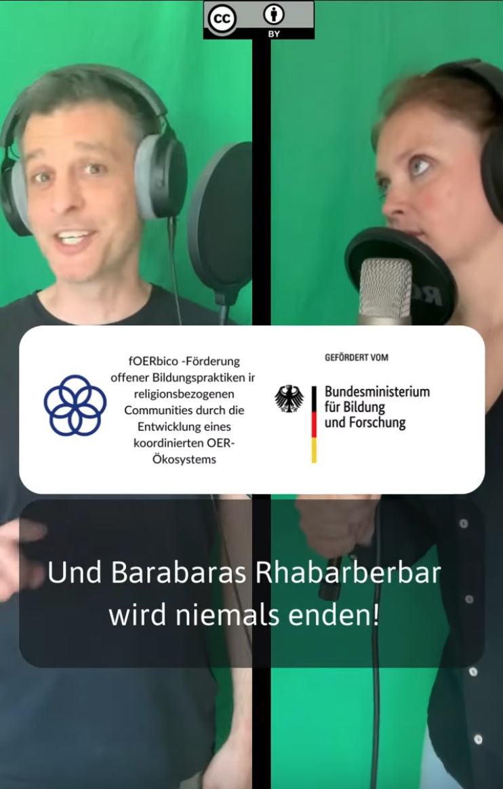

---
#commonMetadata:
'@context': https://schema.org/
creativeWorkStatus: Published
type: LearningResource
name: '#OER erklärt an der Rhabarberbar'
description: >-
  Jörg und Corinna erklären euch an der "Rhabarberbar", was sich hinter dem
  Akronym OER verbirgt und nehmen euch mit in die Welt der Open Educational
  Resources (OER). Wir wollen euch zeigen, dass OER und offene Bildungspraktiken
  Spaß machen können und laden euch ein, die Vorteile von freien Lehr- und
  Lernmaterialien zu entdecken und anzuwenden. 
license: https://creativecommons.org/licenses/by/4.0/deed.de
id: >-
  https://git.rpi-virtuell.de/Comenius-Institut/fOERbico/_edit/main/Blog/OER-erkl%C3%A4rt.md
creator:
  - givenName: Gina
    familyName: Buchwald-Chassée
    type: Person
    affiliation:
      name: Comenius-Institut
      id: https://ror.org/025e8aw85
      type: Organization
keywords:
  - OER
  - Community
  - Offenheit
inLanguage:
  - de
about:
image: Rhabarberbar.png
learningResourceType:
  - https://w3id.org/kim/hcrt/video
educationalLevel:
  - https://w3id.org/kim/educationalLevel/level_A
datePublished: '2024-09-04'
#staticSiteGenerator:
author:
  - Gina Buchwald-Chassée
title: OER erklärt an der Rhabarberbar
cover:
  image: Rhabarberbar.png
  hiddenInSingle: true
summary: |
  Jörg und Corinna erklären euch an der "Rhabarberbar", was sich hinter dem
  Akronym OER verbirgt und nehmen euch mit in die Welt der Open Educational
  Resources (OER). Wir wollen euch zeigen, dass OER und offene Bildungspraktiken
  Spaß machen können und laden euch ein, die Vorteile von freien Lehr- und
  Lernmaterialien zu entdecken und anzuwenden. 
url: oer-erklaert-an-der-rhabarberbar
---

Was heißt eigentlich OER? Im Bildungsbereich wird das Akronym oft selbstverständlich im Sprachgebrauch verwendet, aber nicht jede:r weiß auf Anhieb, wofür das Kürzel eigentlich steht. 

OER = Open Educational Resources

Open Eductational Resources meint freie Bildungsmaterialien, die veröffentlicht und weitergenutzt werden dürfen. Hierbei gilt es die Lizenzen zu beachten, mehr dazu erfahrt ihr hier. 

Besuche Corinna Ullmann und Jörg Lohrer an der RhababOERbar und erfahre, was hinter OER steckt und entdecke deine Möglichkeiten Materialien für die religionsbezogene Bildung zu teilen!

