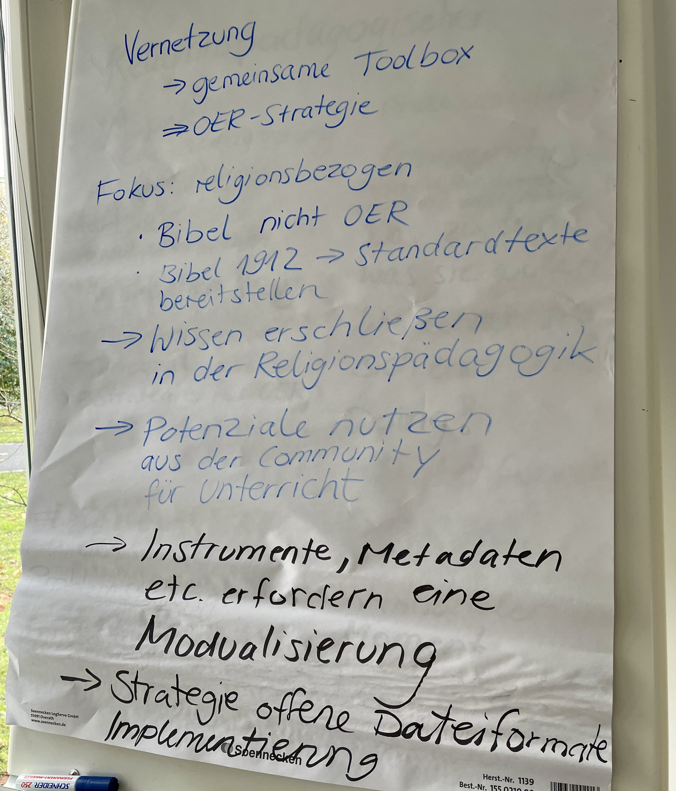

# Konzeptionstag von rpi-virtuell & FOERBICO: Gemeinsam neue Wege im religiösen Bildungsbereich gestalten

Wie können wir verschiedene Bildungsakteure aus dem Religionsbereich zusammenbringen und niedrigschwellige Zugänge für die Zusammenarbeit schaffen, ohne den Plattformdschungel zu vergrößern? Dazu kamen die Teams von rpi-virtuell und FOERBICO zu einem Konzeptionstag in der Goethe-Universität in Frankfurt zusammen, um sich intensiv mit der strategischen Weiterentwicklung ihrer digitalen Angebote zur Stärkung religiöser Bildung auseinanderzusetzen. Neben der Verhältnisbestimmung zwischen den beiden Teams und der Entwicklung einer gemeinsamen Vision lag der Fokus auf den Fragen, wie wir bedarfsgerechte Vernetzungs- und Unterstützungsangebote für Bildungsakteure im religionspädagogischen Bereich schaffen können. Wie der Tag lief und zu welchen Ergebnissen wir gekommen sind, erfahrt ihr im Blogbeitrag!

## Vorstellung rpi-virtuell – digitale Plattform für religionspädagogische Bildung 

Wofür steht eigentlich [rpi-virtuell](https://rpi-virtuell.de/) und welche Potentiale, aber auch Herausforderungen sehen wir? rpi-virtuell ist der digitale Ort für evangelischen Bildungshandel und eine zentrale Marke des Comenius-Instituts im Bereich Digitalisierung und Vernetzung. Die Plattform begleitet Lernprozesse, unterstützt Kooperationen und bietet eine Infrastruktur für religionspädagogische Bildung in einer zunehmend digital geprägten Kultur.
Mit Religion in einer Kultur der Digitalität als Schwerpunkt vernetzt rpi-virtuell Akteure aus Bildung und Kirche, darunter auch die [ALPIKA](https://alpika.de/)-Institute und öffnet Räume für die kreative Nutzung der Digitalisierung in Bildungsprozessen.

Unter dem Motto **rpi hoch 4** wird ein Angebot gestaltet, das **i**nformativ, **i**nnovativ und **i**ntegrativ ist – und dabei eine verlässliche **I**nfrastruktur bietet. Unser Ziel ist es, das volle Potenzial digitaler Werkzeuge für die religionspädagogische Arbeit auszuschöpfen, gleichzeitig aber auch die Herausforderungen wie technische Zugänglichkeit und nachhaltige Community-Bindung aktiv anzugehen. Mit der [SWOT-Methode](https://www.orghandbuch.de/Webs/OHB/DE/OrganisationshandbuchNEU/4_MethodenUndTechniken/Methoden_A_bis_Z/SWOT_Analyse/swot_analyse_node.html) haben wir Potentiale und Herausfoderungen für die Weiterentwicklung rausgearbeitet. 

### Ergebnis der SWOT-Analyse:

*Stärken:* Umfangreiche Materialsammlung, aktive Beteiligung durch Vernetzung, Plattform für religionsbezogene Bildung, technische Infrastrukturen, Bereitstellung von Ressourcen, offene Bildungsmaterialien

*Chancen:* Technische Infrastruktur ermöglicht auf technische Entwicklungen einzugehen, KI-gestütze Bildungsressourcen zu erschließen, Vernetzung & Vernetzung & Zusammenarbeit mit anderen Plattformen, Religionspädagogik iund Kultur der Digitalität im Bildungswesen zu transformieren

*Schwächen:* Klares Konzept & Profil, Akzeptanzschwierigkeiten der "losen" Materialien, Qualitätskriterien & Transparenz (der eigenen Arbeit)

*Risiken:* finanzielle & personelle Ressourcenknappheit + strukturelle Änderungen (erfordert gute Planung), technologische Herausforderungen: digitale Trends und ständige Anpassung (brauchen Flexibilität), Konkurrenz durch andere Plattformen (nicht mehr einziger Anbieter auf dem Markt, dürfen nicht untergehen -> was macht uns besonders / einzigartig?)

**Fazit:** rpi-virtuell unterstützt bereits viele Communities, aber weitere sollen dazukommen und besser vernetzt werden. Und genau da setzt das Projekt FOERBICO an!

Im Sinne einer Community of Communities zielt FOERBICO auf die Vernetzung und den Austausch von verschiedenen religionsbezogenen Communities, um offene Bildungspraktiken (Open Educational Practices = OEP) zu fördern und „raus aus den Bubbles“ zu kommen. 
Unsere gemeinsame Vision: Eine möglichst offene Lehr- und Lernkultur in der religiösen Bildung schaffen! Dazu soll ein Community-Hub als Schnittstelle zwischen rpi-virtuell und FOERBICO entstehen. 

## Kreative Lego-Pause: Eindruck braucht Ausdruck

Nach ganz viel wichtigem Input wurde es nun etwas spielerischer: Wie stellen wir uns rpi-virtuell und FOERBICO zusammen vor? Was daraus entstehen kann, seht ihr hier:

## Ziele formulieren mit der SMART-Methode

Nun wurde es konkreter: Anhand der SMART-Methode (= **S**pezifisch, **M**essbar, **A**ttraktiv, **R**ealistisch und **T**erminiert) haben wir begonnen folgende Themenfelder zu beleuchten und konkrete Arbeitsaufträge festzulegen: 

1. Qualität von Bildungsmaterialien (Merkmale, didaktischer Kontext, Unterstützung bei Erstellung/Anpassung)

Hier sind vor allem zwei Ideen entstanden:

- Eine Art „**OER-Canva**“ als eine userfreundliche Möglichkeit OER-Material OER schnell und einfach zu erstellen mit Bildern und Grafiken die ich verwenden kann. Um Rechtssicherheit zu gewähren, müssten die Inhalte unter CC-Lizenz verfügbar sein, sodass man sich darauf verlassen, dass sie verwendet werden dürfen.

- **Qualitätschecker:** Ein automatisierter Check, der neben technischen Dimensionen wie CC-Lizenzangabe, Barrierefreiheit o.Ä. und Usability (z.B. Interaktivität, Gestaltung etc.) auch Merkmale wie Binnendifferenzierung, Kompetenzen, Aktualität etc. sowie Spezifika der Religionsdidaktik (z.B. Biblisches, ästhetisches, dialogisches, konstruktives, performatives, biographisches, Diversitäts-/Gendersensibles, erinnerungsgeleitetes und interkulturelles/interreligiöses Lernen) berücksichtigt. 

2. Positionierung im Wettbewerb (Abgrenzung Materialpool rpi-virtuell, Vernetzungsmöglichkeiten mit weiteren Plattformen, Verbesserung der Usability / Attraktivität aufzeigen)

Ziel ist es, langfristig tragfähige Nachhaltigkeitsstrukturen für Inhalte zu schaffen, die von Usern, rpi-virtuell, FOERBICO und den zugehörigen Communitys erstellt werden. Dabei steht der Anspruch im Vordergrund, Hyperlinks, Archive und bestehende Inhalte dauerhaft und sicher zugänglich zu halten. Dies gewährleistet nicht nur die Nutzbarkeit vergangener Materialien, sondern stärkt auch das Vertrauen der Nutzenden in die Verlässlichkeit unserer Plattformen.
Ein wesentliches Qualitätskriterium für künftige Inhalte ist es, den Erstellenden die Möglichkeit zu geben, eigenständig Verantwortung für die Pflege und Aktualität ihrer Beiträge zu übernehmen. Unsere technischen Infrastrukturen sollen dies effektiv unterstützen, sodass der Gedanke von Selbstständigkeit und Nachhaltigkeit in der Community-Arbeit gestärkt wird. Indem wir diesen Ansatz fördern, bauen wir nicht nur eine stabile Basis für bestehende Inhalte, sondern schaffen auch ein zukunftssicheres Fundament für weiteres Wachstum und Innovation.

3. KI-Integration & Digitalisierung (Wie kann KI sinnvoll genutzt z.B. zur Qualitätssicherung oder personalisierte Unterrichtshilfen werden?)

- KI als Unterstützungsinstrument in der Materialerstellung, z.B. durch Chatfunktionen, Prüfung, Feedback, Inhaltsgestaltung etc.
- KI und personelle Strukturen, hier kann KI unterstützen, indem Beta-Informationen aus Materialien aufbereitet, Schlüsselwörter automatisiert und Taxonomien in der Suche angewendet werden und das nicht mehr manuell durch eine Person gemacht werden muss.

4. Netzwerkbildung und Community-Integration (Vernetzung externer Bildungsakteure und bestehender Netzwerke, um mit-, von- und untereinander zu profitieren)

Zentraler Aspekt war hier die Kommunikation mit der Community. Erste Ideen sind ein gemeinsamer Content-Pool, in dem Informationen aus den verschiedenen Communities automatisiert eingespeist werden, die dann wiederum von den jeweiligen Akteuren wieder in ihre Netzwerke gestreut werden können. Die Idee ist quasi ein gemeinsames News(-letter)-System: Ich sehe die Beiträge aller Communities und kann mir die rausziehen, die für meine jeweilige Community interessant sein könnten und die News somit breiter streuen. Neben der technischen Komponente braucht es aber Schlüsselpersonen, die in mehreren Communitys unterwegs sind und als Multiplikator:innen Vernetzung voranbringen könnten. Bis Ende Januar 2025 wollen wir ein Prozessflussdiagramm zur Kommunikation mit den Communities entwickeln.

5. Technologische Infrastruktur (Dezentraler Austausch & userfreundliche Gestaltung)

Der Materialpool von rpi-virtuell soll religionspädagogische Ressourcen besser zugänglich und nutzbar machen, indem Materialien aus Communitys und Plattformen automatisiert erschlossen und strukturiert angeboten werden. Geplant sind klare Suchkriterien (Alter, Thema, Methode), aktuelle Inhalte und hohe Qualitätsstandards. Offene Zugänge und Vernetzung, etwa über WLO-Schnittstellen, ermöglichen Kooperationen und fördern eine gemeinwohlorientierte Nutzung. Gleichzeitig stellen urheberrechtliche Fragen, die Abgrenzung zu kommerziellen Plattformen und die Benutzerfreundlichkeit zentrale Herausforderungen dar, die es zu lösen gilt. Ziel ist ein innovativer und effizienter Materialpool, der Lehrkräfte nachhaltig unterstützt. Dennoch bleiben Fragen nach dem Urheberrecht und Kooperationsverträgen offen, die es noch zu klären gilt.

Wir machen uns nun voller Tatendrang an die Weiterarbeit und halten euch auf dem Laufenden!

## Qualitative Befragung religionsbezogener Communities: Einblicke und Erkenntnisse

Im Rahmen einer qualitativen Studie wurden zehn leitfadengestützte Interviews mit insgesamt elf Personen aus verschiedenen religionsbezogenen Communities durchgeführt. Der Fokus lag auf dem Umgang mit Open Educational Resources (OER) und deren Integration in offene Bildungspraktiken (OEP). Zwei weitere Interviews, die noch ausstehen, werden zeitnah nachgeholt. Die befragten Personen waren Teil von Netzwerken wie rpi-virtuell, relilab, relimentar, reliGlobal und schule-evangelisch-digital. Ziel der Interviews war es, zentrale Fragestellungen zu OER und OEP in den Communities zu beantworten:

1.	Wie wird in den Communities mit OER gearbeitet (Produktion, Selektion, Qualitätssicherung etc.)?

2.	Welche offenen Bildungspraktiken (OEP) lassen sich identifizieren?

3.	Wie gestaltet sich die Vernetzung innerhalb und zwischen den Communities?

4.	Welche Stärken, Herausforderungen und Bedarfe sehen die Akteure?

Die Auswertung erfolgte anhand eines deduktiv entwickelten Codebaums, ergänzt durch induktiv generierte Codes, die auf spezifischen Aussagen der Interviewpartner basieren.

### Ergebnisse der Befragung

Die Befragten zeigten eine hohe Vertrautheit mit OER und deren Grundprinzipien. OER wird als Möglichkeit gesehen, Bildungsressourcen kollaborativ zu erstellen und anzupassen. Es gibt jedoch deutliche Unterschiede in der Gewichtung von OER zwischen den Communities: Während einige Plattformen ausschließlich OER-konforme Materialien anbieten, spielt dies bei anderen eine untergeordnete Rolle.

Einige Akteure kannten den Begriff Open Educational Practices (OEP) nicht oder nur oberflächlich. Dennoch zeigte sich, dass kollaborative Ansätze in den Communities bereits gelebt werden und ein Konsens darüber besteht, dass Materialien gemeinschaftlich weiterentwickelt werden können. Die Befragung zeigte, dass Communities nicht nur Orte sind, in denen OER entstehen, sondern auch Inspiration und Begegnung ermöglichen. 

Allerdings bestehen deutliche Hürden:

•	Rechtliche Unsicherheiten hemmen die Materialerstellung.
•	Die Produktion von OER erfordert hohe individuelle Ressourcen.
•	Institutionen erkennen den Mehrwert von OER oft nicht und bleiben bei geschlossenen Ansätzen.

Ein zentraler Bedarf ist daher die Bereitstellung von Tools und Unterstützungsangeboten zur Erstellung von OER. Weitere Ideen:

Alternativ Mermaid Chart -> Phillip?

Die Befragungsergebnisse konnten wir während der Mittagspause sacken lassen! Danach ging es in Kleingruppen zu Community & Netzwerk sowie Technik & Werkzeuge weiter:

Und dann war der Tag auch schon vorbei! Auch Rom wurde nicht an einem Tag erbaut und so arbeiten wir weiter zusammen hin zu einem Community-Hub – nun erstmal wieder digital, aber der persönliche Austausch hat uns allen gutgetan :-)

